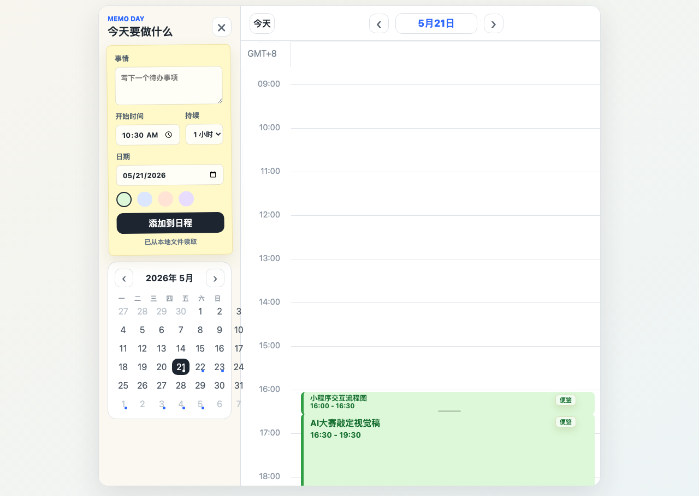

# Codex 第三节课作业：Memo Day 本地工作日程工具

## 1. 原始需求

我日常会同时处理课程学习、私域/小程序相关工作、文档产出、会议沟通和临时事项。问题不是“没有待办工具”，而是普通待办列表很难回答三个问题：

1. 今天每个时间段实际安排了什么？
2. 某个任务当时留下了什么备注、结论或后续线索？
3. 写周报、复盘或回看工作节奏时，能不能快速找到当天轨迹？

所以我需要一个本地可用的小工具，把“待办”变成“按时间段沉淀的工作记录”。

## 2. MVP 版本

Memo Day 第一版聚焦个人本地使用，不做账号、不做协作、不做复杂项目管理，只完成一个真实闭环：

1. 选择日期，查看当天时间轴。
2. 新增事项，填写标题、开始时间、持续时长和颜色分类。
3. 在时间轴中展示事项卡片。
4. 支持日历切换历史日期。
5. 支持删除事项。
6. 支持点击事项打开备注弹窗，保存该时间段的信息。
7. 支持在时间轴上点击选择时间段，并快速填入表单。
8. 支持拖动调整事项时长。
9. 支持本地文件保存到 `events.json`，浏览器 `localStorage` 作为兜底。
10. 支持本地 Web 运行，并提供 macOS 本地 App 包装。

## 3. 验收标准

最低验收：

1. 运行 `npm start` 后可以打开 `http://127.0.0.1:4173/index.html`。
2. 页面能显示新增事项表单、日历和每日时间轴。
3. 新增事项后，事项能出现在对应日期的时间轴上。
4. 切换日期后，只显示当天事项。
5. 删除事项后，时间轴和本地数据同步更新。
6. 打开事项备注、保存备注后，刷新页面备注仍可保留。
7. 关闭服务时，浏览器本地备份仍能保留数据。
8. `events.json` 数据结构清晰，可继续扩展。

优秀验收：

1. 它解决真实工作里的“日程 + 备注 + 回看”问题，不只是演示页面。
2. 支持本地文件保存，避免个人记录只停留在浏览器缓存。
3. 支持 macOS App 包装，使用方式接近本地应用。
4. 具备可复用的项目 Skill，可迁移到周报、复盘、个人任务管理等场景。

## 4. 使用 Codex + Superpowers 的开发过程

本项目按照第三节课的方法整理为计划驱动开发流程：

1. 使用需求澄清思路，先确认 Memo Day 的核心目标不是做大而全日历，而是解决个人工作日程记录。
2. 定义 MVP 范围，只保留本地日程、时间轴、备注、保存和回看闭环。
3. 拆成多个可执行任务：页面骨架、事件数据、时间轴交互、本地服务、离线能力、macOS 包装、文档沉淀。
4. 每个任务都用明确边界控制范围，不做登录、协作、云同步、复杂统计。
5. 完成后做本地运行验证，并沉淀项目 Skill。

## 5. 沉淀项目 Skills

本项目沉淀的项目 Skill 是：

`memo-day-workday-capture`

它用于把一天中的工作事项、会议、临时任务和后续备注整理成一个可回顾的本地时间线。详细内容见：

`docs/project-skill.md`

## 6. 项目代码 GitHub/GitLab

项目已经整理为可上传仓库，并按模块拆分提交记录：

1. `chore: bootstrap memo day workspace`
2. `feat: build timeline scheduling interface`
3. `feat: add event data and timeline interactions`
4. `feat: persist events with local node server`
5. `feat: add offline app shell and mac wrapper`
6. `docs: add codex homework writeup and project skill`

上传后将仓库地址补充在这里：

GitHub/GitLab：待填写

## 7. 运行方式

```sh
npm start
```

然后打开：

```txt
http://127.0.0.1:4173/index.html
```

## 8. 运行截图



## 9. 为什么这个作业适合作为优秀案例

Memo Day 不是为了课堂临时造的 Demo，而是来自真实个人工作场景：每天要处理多条任务、会议、课程、文档和设计交付，需要一个低摩擦工具帮助记录时间分布和事项备注。

它的业务深度体现在：

1. 从普通待办升级为按时间段组织的工作记录。
2. 支持备注沉淀，方便周报和复盘。
3. 本地保存优先，适合个人工作记录。
4. 第一版范围克制，但完整覆盖“新增、查看、备注、保存、回看”的闭环。
5. 项目结束后沉淀了可复用 Skill，后续可以继续扩展到周报生成、工作复盘、任务分类统计。

